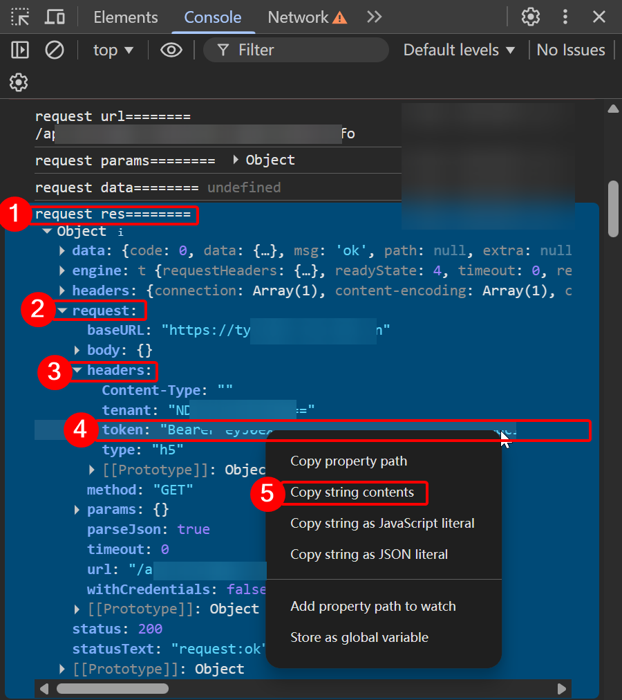

# ML SEU Exercise Helper

## 概述
本项目旨在帮助 SEU 的本科生更好地进行课外锻炼，完全开源，请勿商业化，请自觉遵循 [GPLv3 许可证](LICENSE)。

本项目有着简洁美观的 WebUI, 操作简单，是本科生们课外锻炼的得力助手。

如果大家喜欢本项目，请给颗小星星哦~

欢迎 Star、Fork 和 PR！

## 界面截图

## 使用方法
下载 [Release](https://github.com/midairlogn/ML-SEU-Exercise-Helper/releases) 中的最新版本，用浏览器打开 `.html` 。(推荐在电脑上操作)

填入你的Token，选择场地、时间，并上传两张照片作为开始、结束照片。

> 这里照片采用自拍，人脸尽量占据整个画面。   
> 可以使用相同的照片，但是一定要本人的。

> 作者 [Midairlogn](https://github.com/midairlogn) 推测此照片仅用于人脸识别，验证是否是本人在跑。

点击 `提交跑步记录` 按钮即可 ( **需要校园网** )，**在成功提示窗口弹出前切勿离开、关闭页面**！

等待弹出成功提示窗口(见下图)，就可以在微信小程序中看到上传的跑步记录了。

### 隐藏功能
**可以补之前的跑步记录，也可以超前跑哦~**

### Token获取说明
> Token形如 `Bearer [part1].[part2].[part3]`。

这里作者仅介绍较为简单的方法。

1. 打开 [https://tyxsjpt.seu.edu.cn/h5/#/pages/home/index](https://tyxsjpt.seu.edu.cn/h5/#/pages/home/index) ，登录账号。

2. 按 `F12` (有的电脑是 `Fn + F12` )打开浏览器的开发人员工具，进入 `控制台` ( `console` )。

3. 展开 `request res========` 后面的 `object` ，找到 `request.headers.token` 。

4. 右键复数字符串内容。**注意: 不需要引号!**

#### 图解

##### 顺便提一嘴较为复杂的方法。

打开相应的微信小程序, 用CE搜索: `Bearer ey`, 复制找到的Token即可。

## 声明

本项目遵循 [GPLv3 许可](LICENSE)，请保持代码开源，切勿商业化。

**作者不对用户使用本项目可能造成的后果负责，也不对用户使用本项目上传的数据真实性负责。**

## 郑重声明

本项目由作者使用抓包、分析官方网页 [https://tyxsjpt.seu.edu.cn/h5/#/pages/home/index](https://tyxsjpt.seu.edu.cn/h5/#/pages/home/index) 源代码、使用 `Cheat Engine` 分析微信小程序等方法进行研究后，在AI的辅助下编写，无意中与 [leostudiooo](https://github.com/leostudiooo) 的另外一个仓库 [GOOSE](https://github.com/leostudiooo/GOOSE) 有着相同的轨迹、代码逻辑等。

对此，本人郑重作出如下声明：

1. 本人尊重 [leostudiooo](https://github.com/leostudiooo) 开发的工具 [GOOSE](https://github.com/leostudiooo/GOOSE) 与 [PRTS](https://github.com/leostudiooo/prts)，也可以深刻体会到开发此类项目的艰辛与汗水。
2. 对于本仓库代码逻辑和与 [GOOSE](https://github.com/leostudiooo/GOOSE) 请求体数据结构一致的现象系针对相同系统开发所至，并不存在互相的抄袭，改写现象。
3. 我将始终保持这本项目的开源状态，也请各位使用、开发者秉承开源精神，在学习交流中共同完善项目代码。
4. 请尊重各位志同道合的开发者们的努力与奉献。

本项目历史基于 [GOOSE](https://github.com/leostudiooo/GOOSE) 的归属信息，以履行 GPL 对已分发版本的溯源义务。