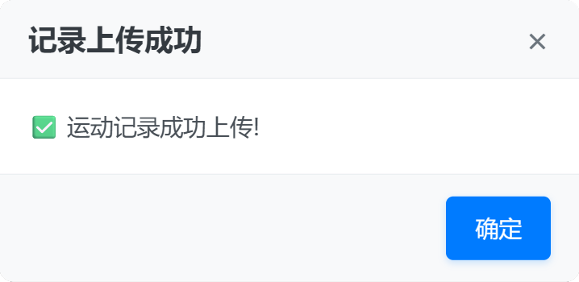

# ML SEU Exercise Helper

## 概述
本项目旨在帮助 SEU 的本科生更好地进行课外锻炼，完全开源，请勿商业化，请自觉遵循 [GPLv3 许可证](LICENSE)。

本项目有着简洁美观的 WebUI, 操作简单，是本科生们课外锻炼的得力助手。

如果大家喜欢本项目，请给颗小星星哦~

欢迎 Star、Fork 和 PR！

## 界面截图

## 使用方法
下载 `Release` 中的最新版本，用浏览器打开 `.html` 。(推荐在电脑上操作)

填入你的Token，选择场地、时间，并上传两张照片作为开始、结束照片。

> 这里照片采用自拍，人脸尽量占据整个画面。   
> 可以使用相同的照片，但是一定要本人的。

> 作者 [Midairlogn](https://github.com/midairlogn) 推测此照片仅用于人脸识别，验证是否是本人在跑。

等待弹出成功窗口(见下图)，就可以在微信小程序中看到上传的跑步记录了。

### Token获取说明
> Token形如 `Bearer [part1].[part2].[part3]`。

这里作者仅介绍较为简单的方法。

1. 打开 [https://github.com/midairlogn/ML-SEU-Exercise-Helper/blob/main/LICENSE](https://github.com/midairlogn/ML-SEU-Exercise-Helper/blob/main/LICENSE) ，登录账号。

2. 按 `F12` (有的电脑是 `Fn + F12` )打开浏览器的开发人员工具，进入 `控制台` ( `console` )。

3. 展开 `request res========` 后面的 `object` ，找到 `request.hearders.token` 。

4. 右键复数字符串内容。**注意: 不需要引号!**

## 声明

本项目遵循 [GPLv3 许可](LICENSE)。这主要意味着以下几点：
- 你可以自由使用、修改和分发本项目的代码。
- 你可以在任何地方使用本项目的代码，但如果你修改了代码并分发了修改后的版本，你必须在同样的许可下分发，也就是说你必须在 `GPLv3` 下开源你的修改。

我们反对使用本项目获取任何形式的商业利益，包括但不限于：
- 使用本项目提供收费的服务；
- 将本项目的代码或修改后的代码作为商业产品出售；
- 等等。

**软件按“原样”（as-is）提供，不附带任何明示或暗示的担保，包括但不限于对特定用途适用性的担保。作者不对因使用本软件产生的任何直接或间接损失、数据丢失、法律责任或其他风险承担责任。**

**本项目基于学习和研究目的开发。软件不对用户上传数据的真实性、准确性、完整性和合法性负责。用户应对其上传的数据承担全部责任，确保其符合实际情况。**